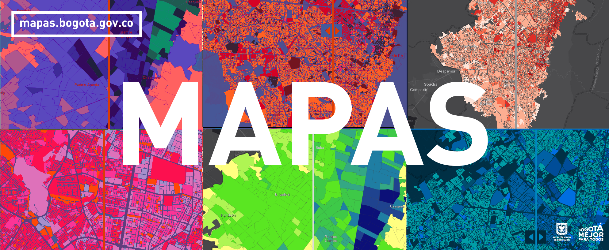

# BIENVENIDOS A MAPAS BOGOTÁ

###                               ¿ Qué puedes hacer en el Mapa Oficial de Bogotá ? 

###                                                     Entidades colaboradoras

Este proyecto es una realidad gracias al trabajo colaborativo, disposición  y sinergia de las entidades del Distrito con la[ Infraestructura de Datos Espaciales de Bogotá D.C.](https://www.ideca.gov.co/); siendo [Mapas Bogotá](http://mapas.bogota.gov.co/) el resultado de este esfuerzo, al integrar y brindar los insumos necesarios para construir una Mejor Bogotá para Todos. [Conoce nuestros colaboradores.](http://idecabogota.maps.arcgis.com/apps/MapTour/index.html?appid=d68afe7909e445a58ee86a3dc0fba2b8)

