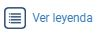

# Estadísticas

**1.**[**Inicia sesión:**](https://mapasbogota.gitbook.io/ayuda/~/edit/drafts/-LIpcmRpNqwU6xMhJzNy/iniciar-sesion) ****Da clic en el menú principal \(ubicado en el costado superior izquierdo de la pantalla\), luego da clic en el botón "Iniciar sesión"


_**Tenga en cuenta:** La funcionalidad estadísticas únicamente está disponible para las entidades del Distrito y deberán tener permisos previos para hacer uso de esta funcionalidad._


**2. Ingresa a estadísticas:** Da clic en el menú principal y luego da clic en el botón estadísticas.

**3. Consulta de información estadística:** Puedes realizar consulta de información de la base de datos de ciudadanos, siguiendo una de las siguientes formas:



**1.Selecciona unidad geográfica:** Da clic en la lista desplegable "Unidad geográfica" y selecciona entre: Localidad, Unidad de planeamiento y sector catastral.

**2.Selecciona un tipo de variable**: Da clic sobre luego da clic sobre la lista desplegable "Tipo variable" y selecciona el tipo de variable de tu preferencia.

**3.Selecciona una variable:** Da clic sobre la lista desplegable "variable" y selecciona la variable que deseas analizar.


_**Tenga en cuenta: Solo puedes consultar 3 variables.**_


**4.Visualiza la gráfica estadísticas:** Cuando eliges una variable automáticamente podrás visualizar la gráfica estadística correspondiente a la variable seleccionada.


_**La cifra que aparece junto a la gráfica corresponde a la cantidad de datos registrados en la base de datos para la variable seleccionada.**_


**5.Consulta el mapa:** Da clic sobre el mapa, podrás ver en la gráfica estadística la cifra correspondiente a la cantidad de datos registrados en la base de datos para esa variable. 


_En el popup que se despliega al dar clic sobre el mapa, se presentan los atributos: Nombre de la localidad, identificador único de la localidad, **población**_ ****_**\(Número de habitantes por localidad\)**_



**Tenga en cuenta:** _Cada vez que interactúe con el mapa debe cerrar el pop-up, para realizar una nueva consulta en las gráficas estadísticas._


**6.Agregar otra variable:** El usuario da clic en el botóny agrega otra variable siguiendo los pasos anteriores _**\(2,3,4\)**_. Podrás ver en la gráfica estadística la cifra correspondiente a la cantidad de datos registrados en la base de datos para esa variable. 

**7. Interactúa con las gráficas:** Da clic sobre una de las opciones que te ofrece la variable en la gráfica. Podrás ver en las gráficas estadísticas las cifras correspondientes a la cantidad de registros en la base de datos para las opciones seleccionadas de cada variable. 


Puedes ver la leyenda en cualquier momento dando clic en el botón  , esto te permitirá conocer que variable estás consultando y entender de mejor forma la información que se presenta en el mapa.


**8. Cambia la gráfica:** Da clic sobre el botón "Ver gráfica" y luego da clic en la lista "Tipo gráfico", selecciona entre barras, líneas, áreas, tortas y donas. Cierra la ventana cuando termines.

**9. Interactúa con el Mapa:** Da clic sobre el mapa.


_En el popup que se despliega al dar clic sobre el mapa, se presentan los atributos: Nombre de la localidad, identificador único de la localidad, **población**_ ****_**\(Número de habitantes por localidad\)** y  la cifra correspondiente a la última opción seleccionada de cualquiera de las gráficas._


**10. Cruza variables:** Da clic sobre el botón **"Cruzar variables"** 



**1.Selecciona unidad geográfica:** Da clic en la lista desplegable "Unidad geográfica" y selecciona zona definida por el usuario.

**2. Selecciona un tipo de variable**: Da clic sobre luego da clic sobre la lista desplegable "Tipo variable" y selecciona el tipo de variable de tu preferencia.

**3. Selecciona una variable:** Da clic sobre la lista desplegable "variable" y selecciona la variable que deseas analizar.

**4.  Dibuja un área en el mapa:** Ubícate en el mapa y dando clic izquierdo sostenido dibuja el área del cual necesitas obtener información.


El sistema genera automáticamente las gráficas estadísticas correspondientes a cada variable y ademas se despliega tabla de atributos con los registros de las variables seleccionadas.




