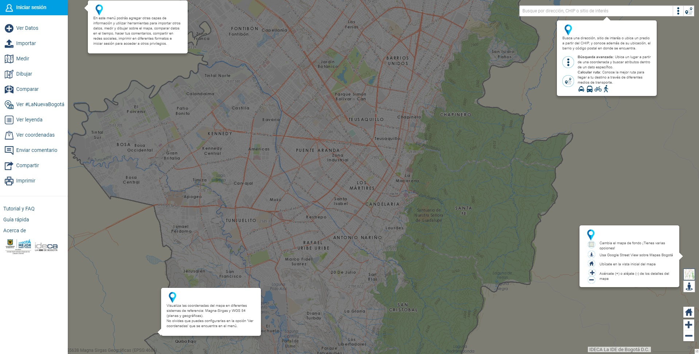

# Herramientas de Navegación

### Conoce las herramientas de navegación

|  | **Cambiar mapa base:** Cambia el fondo del Mapa por alguna de estas opciones: mapas base híbrido, base gris, topográfico y base tóner. |
| :--- | :--- |
|  | **Google Street View:** Recorre la ciudad visualizando imágenes panorámicas a nivel de calle \(360° de movimiento horizontal y 290° de movimiento vertical\).  Esta funcionalidad está incorporada en Mapas Bogotá, de acuerdo a los Términos y Condiciones de uso de Google Street View.  |
|     | **Extensión predeterminada:** Ajusta el Mapa a la visualización inicial predeterminada..  |
|             | **Acercar:** Acércate en el mapa, cada vez que das un clic al signo + obtienes la menor escala del mapa.                                                                                                 **Alejar:** Aléjate en el mapa, cada vez que da un clic al signo - obtienes la mayor escala del mapa. |
|     | **Barra de escala:** Conoce la escala gráfica de visualización actual de la información geográfica sobre el visor.  |
|              | **Vista general del Mapa:** Visualiza la extensión actual del mapa en un contexto geográfico más amplio. |

