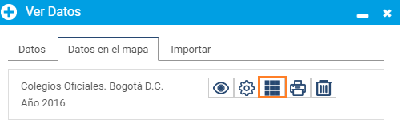

# Tabla de Atributos

**1.Visualiza datos:** Agrega uno o más datos en Mapas Bogotá desde ["Ver Datos"](https://mapasbogota.gitbook.io/ayuda/~/edit/drafts/-LFwQlBPP5PC2nXTBPm8/ver-datos). La visualización de los objetos que tengas en pantalla serán los que se descarguen.

**2.Ingresa a "Tabla de atributos":** Da clic en la pestaña "Datos en el Mapa". Ubica el dato del cual quieres obtener la tabla de atributos y da clic en el botón "Tabla de atributos".

**3.Descarga la tabla:** Selecciona un dato de la lista. Da clic en "seleccionar columnas" y elige la información exacta que vas a descargar. Al dar clic en el tipo de formato automáticamente comienza la descarga del archivo.


Solo podrás descargar hasta _10.000 registros_ y  se exporta únicamente la información de los objetos que tengas en la visualización actual.

SI necesitas obtener información superior a los 10.000 registros, comunícate con nosotros a través de la opción [Enviar Comentarios.](https://mapasbogota.gitbook.io/ayuda/~/edit/drafts/-LFwQlBPP5PC2nXTBPm8/enviar-comentario)


